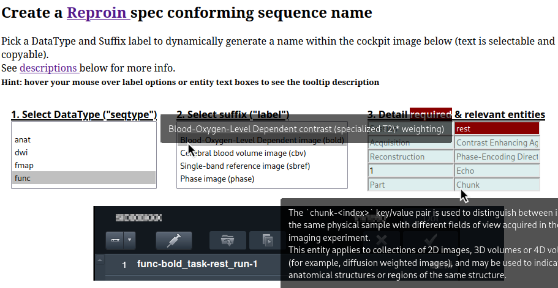
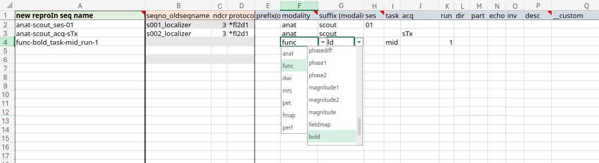

# Namer
[`entity_ux/`](entity_ux/) contains a web app to guide naming sequences.

It's live on https://NPACore.github.io/reproin-namer (via github pages w/ `doc/` symlink). The release zip also contains the static assets needed to view locally and offline.





[ReproIn Creator Spreadsheet](./ReproIn-creator.xlsx) is an alternative. Both the web app and sheet include entity and suffix requirements and description pulled from [`bidsschematools`](https://bidsschematools.readthedocs.io/en/latest/).

## Local and Offline
```bash
# from relase
unzip -d reproin-namer release_1.0.0.zip
firefox reproin-namer/index.html

# from git
git clone https://github.com/NPACore/reproin-namer
cd reproin-namer/entity_ux
firefox index.html
```

# Resources
* [ReproIn](https://dbic-handbook.readthedocs.io/en/latest/mri/reproin.html) sequence name convention/standard
  * Siemens' scanner `Dot Cockpit` and `Exam Card` setup [walk through](https://github.com/ReproNim/reproin/blob/master/docs/walkthrough-1.md) (with screenshots)
  * automation implemented by [heudiconv](https://github.com/nipy/heudiconv/). See [reproin.py](https://github.com/nipy/heudiconv/blob/master/heudiconv/heuristics/reproin.py)
  * [ReproIn Creator Spreadsheet](./ReproIn-creator.xlsx): MRRC template to ReproIn using a formula with per column BIDS key-value pairs. 
  * [Flywheel Study Design Sheet](https://docs.google.com/spreadsheets/d/1Yd74ewWAk4roA-IBfrQuOSMNR4DPxhB9/edit#gid=1495259008) (cf. [gitlab template folder](https://gitlab.com/flywheel-io/public/bids-client/-/tree/master/flywheel_bids/templates))
* goal is near automated [BIDS](https://bids-specification.readthedocs.io/en/stable/#the-brain-imaging-data-structure) Brain Imaging Data Structure conforming scanner dicom to nifti image+json sidecar name conversion.
   * Ideal for input in [fmriprep](https://fmriprep.org/en/stable/)
   * other [BIDS apps](https://github.com/bids-apps/)
   * [Flywheel gears](https://flywheel.io/gear-exchange/#:~:text=View%20Source-,gear%20library,-Gradient%20Anisotropic%20Diffusion).
   * and maybe (hopeful future) facilitate NIH share mandate compliance (cf. [bids2nda](https://github.com/bids-standard/bids2nda))
   * for validation see [bids-validator](https://github.com/bids-standard/bids-validator/) (nodejs)

# Testing names

Consistant naming is not an end in itself! We also want to confirm ReproIn names can easily be moved to BIDS. To that end, this repo also hosts scripts that can update DICOM headers and test the BIDS naming piepline.

## Pipeline

1. `00_dcm-rewrite-from-xlsx.py` rewrites `(0018, 1030) Protocol Name` using ReproIn conforming names in `7T-LunaSPA_ReproIn-SeqName.xlsx` (see sheet w/equations on [onedrive](https://pitt-my.sharepoint.com/:x:/g/personal/foran_pitt_edu/ERWaFHh1IRNCoIXmVds9QE8BzCRw-CqZGFjp4lqlOfOVmg?e=1fnslX))
1. `01_dcm-bids.sh` makes
```
bids/MRRC/SPA_Luna/20231103lunapilotspa2/sub-20231103lunapilotspa2/{anat,dwi,fmap,func}
```
with contents like
```
sub-20231103lunapilotspa2_acq-b0pfc_magnitude_dicom/
sub-20231103lunapilotspa2_acq-b0pfc_magnitude_heudiconv323_e1.nii.gz
sub-20231103lunapilotspa2_acq-b0pfc_magnitude_heudiconv323_e2.nii.gz
sub-20231103lunapilotspa2_acq-b0pfc_magnitude_heudiconv323_e3.nii.gz
sub-20231103lunapilotspa2_acq-b0pfc_magnitude_heudiconv323_e4.nii.gz
sub-20231103lunapilotspa2_acq-b0pfc_magnitude_heudiconv323_e5.nii.gz
```

See [`output-filelist.txt`](txt/output-filelist.txt) for full list.

## Outputs
[`Makefile`](Makefile) builds files in [`txt/`](txt/)

| file                | desc |
|-- |-- |
| [`input-orig.txt`](txt/input-orig.txt)      | original dicom headers per folder |
| [`input-repoin.txt`](txt/input-repoin.txt)  | edited dicom headers using `7T-LunaSPA_ReproIn-SeqName.xlsx` (`00_dcm-rewrite-from-xlsx.py`)|
| [`output-filelist.txt`](txt/output-filelist.txt) | heudiconv output: BIDS filelist |
| [`validate.txt`](txt/validate.txt)          | `bids-validator` output, using [.bidsignore](bidsignore)|

## Issues
* path `SPA_Luna/20231103lunapilotspa2/sub-20231103lunapilotspa2` has redundant ID folder. Should be `SPA_Luna/sub-20231103lunapilotspa2`?
* Does not pass bids validation. see [`validate.txt`](txt/validate.txt).
  * multiple echos as e.g. `_heudiconv323_e5` instead of `_echo-5` 
  * no `.json` files!? (see missing in [`output-filelist.txt`](txt/output-filelist.txt))
* how to encode session? only need in one sequence name?
* `_dicom/` directoires are unwanted (but not a problem for Flywheel?). Ignored with [.bidsignore](bidsignore)

## Dicom Notes

* `00_dcm-rewrite-from-xlsx.py` edits `Protocol Name` and outputs to folders using `Series Number`. 
* `Study Description` sets output folder using `heudiconv --files`: `MRRC^SPA_Luna` becomes `bids/MRRC/SPA_Luna/`

| dicom header | example value |
|-- |--|
|`(0008, 1030) Study Description`| `LO: 'MRRC^SPA_Luna'`|
|`(0010, 0010) PAT Patient Name` | `LO: '20231103Luna_PilotSPA2'` |
|`(0010, 0020) Patient ID`       | `LO: '20231103Luna_PilotSPA2` |
|`(0018, 1030) Protocol Name`    | `LO: 'mtgre_noMT'`|
|`(0020, 0011) Series Number`    | `IS: '48'`|
